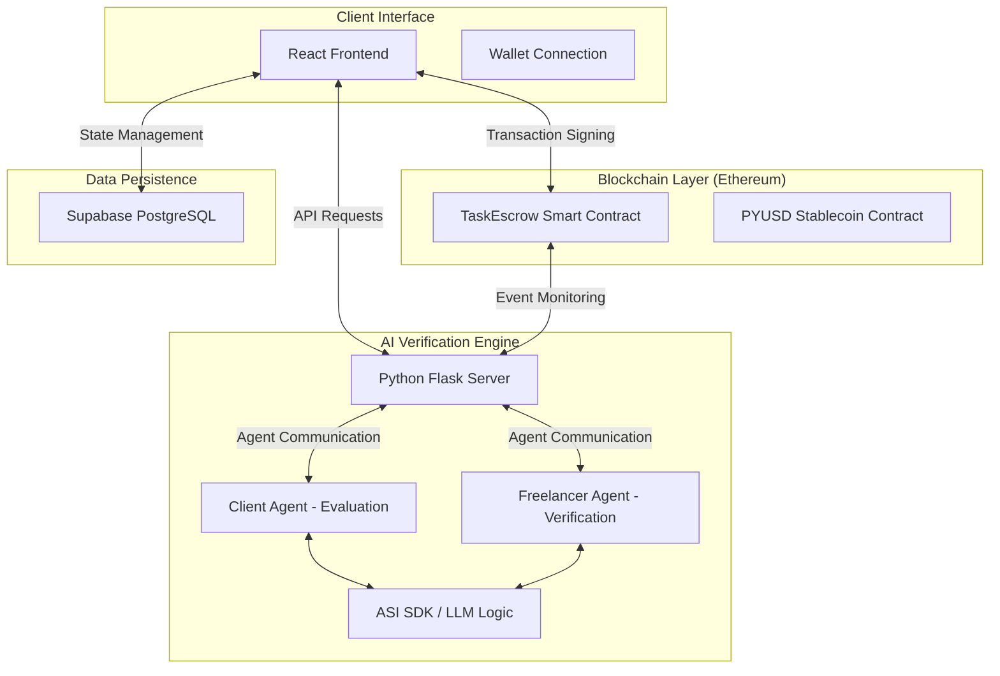

# Jobblify

### Decentralized Freelance Protocol with AI-Driven Verification

[](https://jobblify-jet.vercel.app/)
[](https://ethereum.org/)
[](https://soliditylang.org/)

Jobblify is a next-generation decentralized freelancing platform engineered to bridge the gap between global clients and high-tier professional talent. By integrating immutable smart contracts on the Ethereum blockchain with advanced AI-driven verification agents, Jobblify establishes a trustless ecosystem for project management, automated task vetting, and secure payment processing.

---

## Landing Page Overview


---

## Core Characteristics

### Trustless Escrow Infrastructure
All project financial transactions are managed by audited Solidity smart contracts. Funds are securely locked in escrow and are only released upon client satisfaction and verified submission, ensuring maximum protection for both parties.

### Autonomous AI Verification Layer
Jobblify utilizes Fetch.ai autonomous agents (uAgents) and the ASI SDK to automate complex operational workflows. Our intelligent agents independently evaluate freelancer applications against project requirements and verify the quality of submitted deliverables before payment release.

### Seamless Stablecoin Settlements
To mitigate market volatility and provide predictable project costs, Jobblify standardized on PYUSD (PayPal USD) for all platform transactions. This ensures low-latency, cross-border payments with settled value parity.

### Web3 Native Architecture
The platform features native integration with leading Ethereum wallet providers (MetaMask, Coinbase, OKX). This enables cryptographic identity verification, secure signing of project milestones, and direct on-chain revenue management.

### Transparent Reputation Protocol
Performance metrics and historical project data are recorded on-chain, creating a permanent and verifiable professional record for every freelancer. This promotes meritocracy and simplifies talent discovery for clients.

---

## System Architecture

Jobblify is built on a distributed architecture that synchronizes a high-performance React application, a secure blockchain layer, and a multi-agent AI backend.



---

## Technical Stack

### Frontend Engineering
- **Framework**: React 19 + TypeScript
- **Styling Engine**: Tailwind CSS 4
- **Component Library**: shadcn/ui
- **State Management**: React Context API
- **Web3 Interface**: Ethers.js v6
- **Interaction Layer**: Framer Motion

### Blockchain & Smart Contracts
- **Contract Language**: Solidity 0.8.28
- **Development Environment**: Hardhat
- **Security Standards**: OpenZeppelin
- **Target Network**: Ethereum Sepolia
- **Base Asset**: PYUSD (PayPal USD)

### AI & Backend Services
- **Backend Architecture**: Python Flask / Gunicorn
- **AI Agent Framework**: Fetch.ai uAgents
- **Intelligence Model**: ASI SDK / LLM
- **Database Layer**: Supabase (PostgreSQL with Real-time listeners)

---

## Installation & Configuration

### Prerequisites
| Software | Required Version |
|----------|------------------|
| Node.js  | 18.x or higher   |
| Python   | 3.10.x or higher |
| Browser  | Chrome / Brave   |
| Wallet   | MetaMask / OKX   |

### 1. Repository Setup
Clone the project repository and install the required dependencies for both the frontend and the agent backend.

```bash
# Clone the repository
git clone https://github.com/your-organization/jobblify.git
cd jobblify

# Install frontend dependencies
npm install

# Setup AI Agent environment
cd agent
pip install -r requirements.txt
```

### 2. Environment Configuration
Configuration is required for both the client-side and server-side components.

#### Frontend (.env)
Create a `.env` file in the project root:
| Variable | Description |
|----------|-------------|
| VITE_SUPABASE_URL | Supabase Project URL |
| VITE_SUPABASE_ANON_KEY | Public Anonymous Key |
| VITE_TASK_ESCROW_ADDRESS | Deployed Contract Address |
| VITE_PYUSD_TOKEN_ADDRESS | 0xCaC524BcA292aaade2DF8A05cC58F0a65B1B3bB9 |
| SEPOLIA_RPC_URL | Alchemy or Infura Endpoint |

#### Agent Backend (agent/.env)
Create a `.env` file in the `agent` directory:
| Variable | Description |
|----------|-------------|
| SUPABASE_URL | Supabase Project URL |
| SUPABASE_ANON_KEY | Database Service Key |
| ASI_API_KEY | API key for AI reasoning |

---

## Execution Guidelines

### Smart Contract Deployment
To deploy the TaskEscrow contract to the Sepolia testnet:
```bash
npx hardhat ignition deploy ignition/modules/TaskEscrow.ts --network sepolia
```

### Running Development Environment
Ensure you have the required environment variables set before starting the services.

1. **Frontend Application**:
   ```bash
   npm run dev
   ```

2. **AI Agent Server**:
   ```bash
   cd agent
   python server.py
   ```

---

## Directory Infrastructure

```text
jobblify/
├── src/                # Frontend application logic
│   ├── components/     # Modular UI system
│   ├── pages/          # Application views (Freelancer/Publisher)
│   ├── services/       # On-chain and API integrations
│   └── contexts/       # Global application state
├── contracts/          # Secure Solidity core
├── agent/              # Fetch.ai AI agent logic & server
├── ignition/           # Blockchain deployment scripts
├── public/             # Static application assets
└── sql/                # Database schema definitions
```

---

## Deployment Strategy

### Frontend
The frontend is optimized for deployment on **Vercel**. Simply connect the repository and define the environment variables in the dashboard.

### AI Agent Backend
The backend agent server is configured for **Render**. Use the provided `render.yaml` for zero-touch deployment of the Flask-based agent cluster.

---

## License
Jobblify is distributed under the MIT License. Commercial and academic usage is permitted given appropriate attribution.

---

Built for the future of decentralized collaboration.