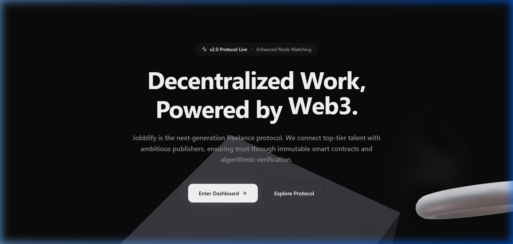
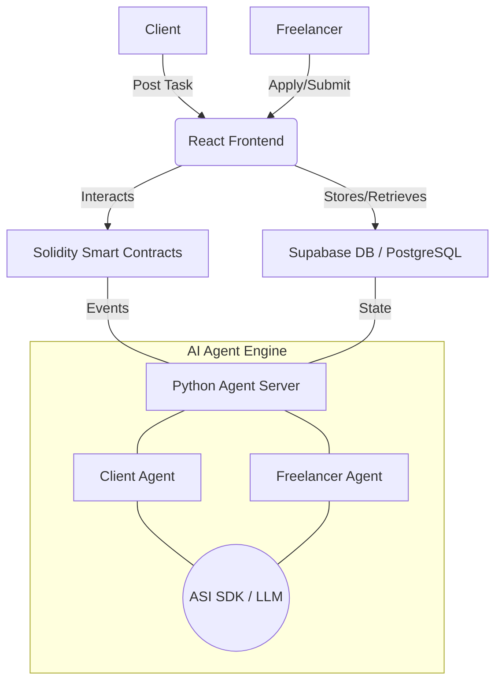

# Jobblify 🚀
### The Next-Generation Decentralized Freelance Protocol

[](https://jobblify-jet.vercel.app/)
[](https://ethereum.org/)
[](https://soliditylang.org/)

Jobblify is a decentralized freelancing platform that bridges the gap between clients and top-tier talent through immutable smart contracts and AI-driven verification. By leveraging the Ethereum blockchain and Fetch.ai's agentic ecosystem, we ensure trust, security, and efficiency in every transaction.

---

## 🖼️ Full Landing Page Preview



---

## 🔥 Key Features

- **🛡️ Trustless Escrow**: Payments are secured by audited smart contracts on the Ethereum Sepolia network. Funds only release when the client approves the work.
- **🤖 AI-Driven Verification**: Automated task vetting and freelancer screening powered by Fetch.ai UAgents and ASI SDK.
- **💳 Universal Payments (PYUSD)**: Support for PayPal's PYUSD stablecoin, providing global, low-cost cross-border payments.
- **⚡ Web3 Native**: Seamless Ethereum wallet integration (MetaMask/Coinbase) for zero-friction identity and payment management.
- **📈 Transparent Reputation**: On-chain freelancer history ensures high-quality outcomes and clear metrics.
- **🔍 Task Marketplace**: A sleek, performant interface for browsing, filtering, and applying for gigs.

---

## 🏗️ System Architecture

Jobblify combines a modern React frontend with a robust backend of smart contracts and AI autonomous agents.



---

## 🛠️ Tech Stack

### Frontend & UI
- **Framework**: [React 19](https://react.dev/) + [TypeScript](https://www.typescriptlang.org/)
- **Styling**: [Tailwind CSS 4](https://tailwindcss.com/)
- **UI Components**: [shadcn/ui](https://ui.shadcn.com/)
- **Web3 Interface**: [Ethers.js 6](https://docs.ethers.org/v6/)
- **Animations**: [Framer Motion](https://www.framer.com/motion/)

### Blockchain & Smart Contracts
- **Language**: [Solidity 0.8.28](https://soliditylang.org/)
- **Framework**: [Hardhat](https://hardhat.org/)
- **Standards**: [OpenZeppelin](https://www.openzeppelin.com/)
- **Network**: Ethereum Sepolia Testnet
- **Token Support**: PYUSD (PayPal USD)

### Backend & AI Intelligence
- **Platform**: [Supabase](https://supabase.com/) (PostgreSQL + Realtime)
- **AI Framework**: [Fetch.ai UAgents](https://fetch.ai/)
- **Logic Engine**: [ASI SDK](https://asi.ai/) (Artificial Superintelligence)
- **Server**: Python 3 / Flask

---

## 🚀 Getting Started

### Prerequisites

| Tool | Version |
|------|---------|
| Node.js | v18+ |
| Python | v3.8+ |
| Wallet | MetaMask / OKX |
| Tokens | Sepolia ETH & PYUSD |

### 1. Installation

```bash
# Clone the repo
git clone https://github.com/yourusername/jobblify.git

# Install Frontend Deps
npm install

# Install Agent Deps
cd agent
pip install -r requirements.txt
```

### 2. Environment Configuration

Create a `.env` in the root for the frontend:
```env
VITE_SUPABASE_URL=your_supabase_url
VITE_SUPABASE_ANON_KEY=your_supabase_anon_key
VITE_TASK_ESCROW_ADDRESS=deployed_contract_address
VITE_PYUSD_TOKEN_ADDRESS=0xCaC524BcA292aaade2DF8A05cC58F0a65B1B3bB9
SEPOLIA_RPC_URL=your_sepolia_rpc_url
```

Create a `.env` in `/agent` for the backend:
```env
VITE_SUPABASE_URL=your_supabase_url
VITE_SUPABASE_ANON_KEY=your_supabase_key
ASI_API_KEY=your_asi_key
```

### 3. Deployment

**Smart Contracts:**
```bash
npx hardhat ignition deploy ignition/modules/TaskEscrow.ts --network sepolia
```

**Run Development Servers:**
```bash
# Terminal 1: Frontend
npm run dev

# Terminal 2: AI Agents
cd agent
python server.py
```

---

## 📁 Project Structure

```text
Jobblify/
├── src/                # Modern React Application
│   ├── components/     # shadcn-based modular components
│   ├── pages/          # Next-gen UI views
│   ├── services/       # Blockchain & API logic
│   └── contexts/       # Global state (Wallet, Auth)
├── contracts/          # Audited Solidity core
├── agent/              # Fetch.ai autonomous agents
├── ignition/           # Hardhat deployment scripts
├── assets/             # Project media & documentation images
└── sql/                # Database migrations & schemas
```

---

## 🛡️ License

Distributed under the MIT License. See `LICENSE` for more information.

---

<p align="center">
  Built with ❤️ for the decentralized future.
</p>